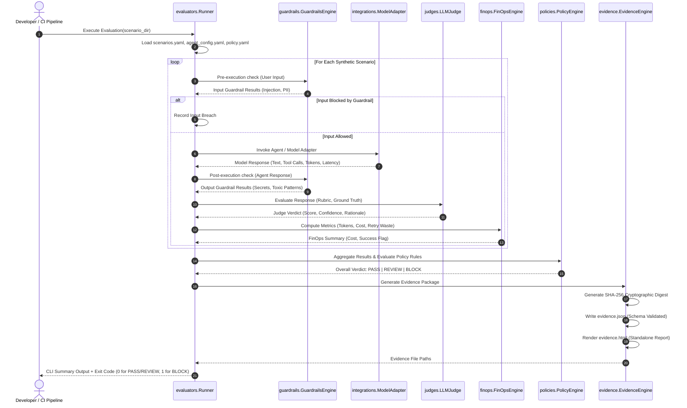

# AgentGuard Framework — Architecture Specification

**Version:** 0.1.0-alpha  
**Status:** Approved Architecture Baseline  
**Classification:** Independent Open-Source Project

---

## 1. System Overview

AgentGuard Framework is structured as a modular, vendor-neutral control plane. It decouples agent execution from policy evaluation, guardrail enforcement, FinOps tracking, and evidence generation.

The architecture emphasizes:
1. **Interface Isolation:** The core engine interacts with models and agents solely through abstract adapter interfaces.
2. **Layered Defense:** Microsecond deterministic filters catch known threats before executing deeper semantic judges.
3. **Deterministic Reproducibility:** Every evaluation run produces deterministic outputs given identical model responses, policies, and synthetic datasets.
4. **Offline First:** Default operation and test suites require zero external network access.

---

## 2. High-Level Component Architecture

```
+----------------------------------------------------------------------------------------------------+
|                                    Target AI Agent / Workflow                                      |
+----------------------------------------------------------------------------------------------------+
                                                  │
                                                  ▼
+────────────────────────────────────────────────────────────────────────────────────────────────────+
|                                    AgentGuard Gateway                                              |
|  - Intercepts Inbound Requests, Prompts, System Prompts, Tool Invocations, and Final Responses     |
|  - Applies Pre-Execution & Post-Execution Filters                                                  |
+──────────────────────────────────┬─────────────────────────────────┬───────────────────────────────+
                                   │                                 │
                                   ▼                                 ▼
┌──────────────────────────────────────┐  ┌──────────────────────────────────────┐  ┌──────────────────────────────────────┐
│          guardrails Module           │  │          evaluators Module           │  │            finops Module             │
│ ──────────────────────────────────── │  │ ──────────────────────────────────── │  │ ──────────────────────────────────── │
│ • Regex/Entropy Secret Scanner       │  │ • Scenario Runner & Harness          │  │ • Token Counter (Prompt/Completion)  │
│ • Heuristic Injection Detector       │  │ • Deterministic Safety Checks        │  │ • Pricing Engine (Rate Tables)       │
│ • PII Masker / Detector              │  │ • Metric Aggregator (Acc, Latency)   │  │ • Retry & Loop Waste Auditor         │
│ • Structural Schema Conformance      │  │ • Tool Call Correctness              │  │ • Cost Per Successful Task Metric    │
└──────────────────┬───────────────────┘  └──────────────────┬───────────────────┘  └──────────────────┬───────────────────┘
                   │                                         │                                         │
                   ▼                                         ▼                                         ▼
┌──────────────────────────────────────────────────────────────────────────────────────────────────────────────────────────┐
│                                                      judges Module                                                       │
│  ──────────────────────────────────────────────────────────────────────────────────────────────────────────────────────  │
│  • Versioned Evaluation Rubrics (e.g. Helpfulness, Safety, Groundedness)                                                 │
│  • Pluggable LLM Judge Provider (with deterministic MockJudge for offline testing)                                       │
│  • Calibration Layer (Confidence scoring, Grey-Zone Routing, Human-in-the-Loop Hooks)                                    │
└────────────────────────────────────────────────────────────┬─────────────────────────────────────────────────────────────┘
                                                             │
                                                             ▼
┌──────────────────────────────────────────────────────────────────────────────────────────────────────────────────────────┐
│                                                     policies Module                                                      │
│  ──────────────────────────────────────────────────────────────────────────────────────────────────────────────────────  │
│  • Declarative YAML/JSON Policy Rules Engine                                                                             │
│  • Multi-Tier Decision Resolver: PASS | REVIEW | BLOCK                                                                    │
│  • Release Gate Enforcement (Non-zero exit codes for CI/CD)                                                              │
└────────────────────────────────────────────────────────────┬─────────────────────────────────────────────────────────────┘
                                                             │
                                                             ▼
┌──────────────────────────────────────────────────────────────────────────────────────────────────────────────────────────┐
│                                                     evidence Module                                                      │
│  ──────────────────────────────────────────────────────────────────────────────────────────────────────────────────────  │
│  • Cryptographic Fingerprinter (SHA-256 Digest of inputs, outputs, policies, and results)                               │
│  • JSON Evidence Receipt Generator (conforming to schemas/evidence-receipt.schema.json)                                  │
│  • Standalone Offline HTML Audit Report Generator                                                                        │
└──────────────────────────────────────────────────────────────────────────────────────────────────────────────────────────┘
```

---

## 3. Core Modules Decomposition

The Python package `agentguard` is structured under `src/agentguard/` with the following initial modules:

### 3.1 `gateway`
- **Purpose:** Acts as the ingress/egress controller for agent requests.
- **Key Responsibilities:**
  - Standardizes the `AgentInteraction` context (inputs, system prompt, tool definitions, tool invocations, final outputs, latency, retry counts).
  - Enforces pre-execution and post-execution hooks.

### 3.2 `guardrails`
- **Purpose:** Fast, microsecond-latency deterministic safety and security gates.
- **Key Responsibilities:**
  - `InjectionDetector`: Identifies prompt injection, role-jailbreaks, and system override markers via compiled pattern heuristics.
  - `SensitiveDataDetector`: Scans for PII (emails, phone numbers, credit card tokens) and secrets (API keys, RSA keys, bearer tokens) using high-entropy checks and regex.
  - `ActionGuard`: Validates tool action authorization against an explicit allowlist and flags irreversible actions.

### 3.3 `evaluators`
- **Purpose:** Coordinates test execution across synthetic scenarios.
- **Key Responsibilities:**
  - Loads synthetic test datasets from YAML/JSON files.
  - Drives execution through configured `ModelAdapter`.
  - Computes ground truth comparisons, semantic assertions, and execution timings.

### 3.4 `judges`
- **Purpose:** Semantic evaluation using versioned rubrics.
- **Key Responsibilities:**
  - Formulates structured evaluation prompts with fixed scoring criteria (1–5 scale).
  - Enforces strict JSON output schema from judge models.
  - Implements `MockJudge` for 100% offline, deterministic verification in tests.
  - Includes confidence scoring to trigger human review for edge cases.

### 3.5 `policies`
- **Purpose:** Policy-as-Code evaluation and verdict determination.
- **Key Responsibilities:**
  - Evaluates rules defined in declarative YAML policy files.
  - Determines status:
    - `PASS`: All safety thresholds and quality scores met.
    - `REVIEW`: Non-blocking warning (e.g., marginal quality score or borderline latency).
    - `BLOCK`: Critical policy violation (e.g., prompt injection detected, credential leak, or hard quality failure).
  - Returns appropriate system exit codes (e.g., Exit Code 1 for `BLOCK`).

### 3.6 `monitoring`
- **Purpose:** Real-time and run-time telemetry aggregation.
- **Key Responsibilities:**
  - Tracks round-trip latency, token streams, and agent loop counts.
  - Detects runaway recursion / infinite tool-calling loops.
  - Emits redacted, structured JSON log events.

### 3.7 `finops`
- **Purpose:** Granular cost and token efficiency analytics.
- **Key Responsibilities:**
  - Token consumption tracking (prompt tokens, completion tokens, cached tokens).
  - Unit pricing resolution across configurable model rate cards.
  - Computes retry waste (tokens and currency burned on failed or discarded steps).
  - Metric calculation: **Cost per Successful Task**.

### 3.8 `evidence`
- **Purpose:** Generates audit-grade evidence artifacts.
- **Key Responsibilities:**
  - Creates structured JSON receipts containing scenario details, guardrail triggers, judge rationales, cost metrics, and SHA-256 integrity checksums.
  - Validates receipts against `schemas/evidence-receipt.schema.json`.
  - Produces a self-contained, CSS-styled HTML audit report for compliance reviews.

### 3.9 `integrations`
- **Purpose:** Clean-room abstraction for model and agent interfaces.
- **Key Responsibilities:**
  - `ModelAdapter` abstract base class defining `generate(prompt, **kwargs) -> ModelResponse`.
  - `MockModelAdapter` providing canned or rule-based responses for synthetic evaluation testing without network access.
  - Pluggable provider stubs (OpenAI, Gemini, Anthropic, Ollama) that instantiate only when explicit credentials and packages are present.

---

## 4. End-to-End Data Flow (MVP Evaluation)

The CLI command `agentguard evaluate examples/customer-support-agent` executes the following sequence:



---

## 5. Security & Isolation Boundaries

1. **Secret Redaction in Memory & Disk:** Structured loggers and evidence generators pass all text through redaction filters before persisting to disk.
2. **Deterministic Sandboxing:** The default execution pipeline relies on `MockModelAdapter` and `MockJudge`, guaranteeing that running test suites consumes 0 tokens, creates 0 network sockets, and leaks 0 environment variables.
3. **Receipt Immutability:** Evidence receipts calculate a canonical SHA-256 digest over the sorted JSON representation of all inputs, configuration, and outputs, enabling instant verification against tampering.
